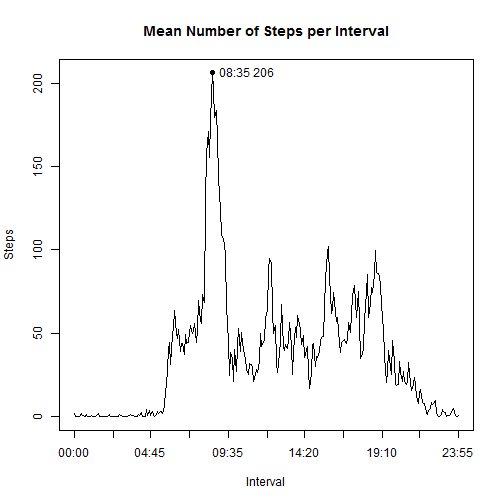

## Loading and preprocessing the data

The original **Activity monitoring data** dataset can be found at [https://d396qusza40orc.cloudfront.net/repdata%2Fdata%2Factivity.zip](https://d396qusza40orc.cloudfront.net/repdata%2Fdata%2Factivity.zip).  The original GitHub repository that was forked to create this repo was [http://github.com/rdpeng/RepData_PeerAssessment1](http://github.com/rdpeng/RepData_PeerAssessment1).

### Load the data


```r
# Examining activity.zip w/ Windows Explorer shows it contains activity.csv
activity_zip_file <- "activity.zip"
activity_csv_data <- "activity.csv"

unzip(activity_zip_file)

activity <- read.csv(activity_csv_data,stringsAsFactors=FALSE)
```

### Process/transform the data into a format suitable for analysis.

I noted that the *interval* wasn't truly linear, e.g. an interval value of
650 was 5 minutes more than an interval value of 645, but the interval value
that was 5 minutes more than 655 wasn't 660 but was 700.  So I created a 
*dateTime* variable that was more linear.


```r
# Examining the csv file shows the date in the 2nd col is format YYYY-MM-DD
activity$DateAsDate <- as.Date(activity[,2])
activity$interval_as_char <- 
   sapply(activity[,3], function(x) paste('000', as.character(x), sep=''))
activity$four_digit_times <- 
   sapply(activity[,5], function(x) substr(x, (nchar(x)+1)-4, nchar(x)))
activity$time <- 
   sapply(activity[,6], 
          function(x) paste(substr(x,1,2),':',substr(x,3,4),sep=''))
activity$dateTime <- 
   strptime(paste(activity$date, activity$time),"%Y-%m-%d %H:%M")
```

## What is mean total number of steps taken per day?

A number of the *steps* values in the activity data frame are NA; here we are
using the activity data frame as is, with the NA values.

### Total number of steps taken per day


```r
total_no_steps_per_day <- aggregate(activity$steps, list(activity$date), sum)
total_no_steps_per_day
```

```
##       Group.1     x
## 1  2012-10-01    NA
## 2  2012-10-02   126
## 3  2012-10-03 11352
## 4  2012-10-04 12116
## 5  2012-10-05 13294
## 6  2012-10-06 15420
## 7  2012-10-07 11015
## 8  2012-10-08    NA
## 9  2012-10-09 12811
## 10 2012-10-10  9900
## 11 2012-10-11 10304
## 12 2012-10-12 17382
## 13 2012-10-13 12426
## 14 2012-10-14 15098
## 15 2012-10-15 10139
## 16 2012-10-16 15084
## 17 2012-10-17 13452
## 18 2012-10-18 10056
## 19 2012-10-19 11829
## 20 2012-10-20 10395
## 21 2012-10-21  8821
## 22 2012-10-22 13460
## 23 2012-10-23  8918
## 24 2012-10-24  8355
## 25 2012-10-25  2492
## 26 2012-10-26  6778
## 27 2012-10-27 10119
## 28 2012-10-28 11458
## 29 2012-10-29  5018
## 30 2012-10-30  9819
## 31 2012-10-31 15414
## 32 2012-11-01    NA
## 33 2012-11-02 10600
## 34 2012-11-03 10571
## 35 2012-11-04    NA
## 36 2012-11-05 10439
## 37 2012-11-06  8334
## 38 2012-11-07 12883
## 39 2012-11-08  3219
## 40 2012-11-09    NA
## 41 2012-11-10    NA
## 42 2012-11-11 12608
## 43 2012-11-12 10765
## 44 2012-11-13  7336
## 45 2012-11-14    NA
## 46 2012-11-15    41
## 47 2012-11-16  5441
## 48 2012-11-17 14339
## 49 2012-11-18 15110
## 50 2012-11-19  8841
## 51 2012-11-20  4472
## 52 2012-11-21 12787
## 53 2012-11-22 20427
## 54 2012-11-23 21194
## 55 2012-11-24 14478
## 56 2012-11-25 11834
## 57 2012-11-26 11162
## 58 2012-11-27 13646
## 59 2012-11-28 10183
## 60 2012-11-29  7047
## 61 2012-11-30    NA
```


```r
hist(total_no_steps_per_day$x, main='Frequency of Total Number of Steps/Day', 
     xlab='Steps')
```

 

### Mean and median of the total number of steps taken per day

We remove NA values to get the mean and median.


```r
mean_no_total_steps_per_day <- mean(total_no_steps_per_day$x, na.rm=TRUE)
median_no_total_steps_per_day <- median(total_no_steps_per_day$x, na.rm=TRUE)
```

The mean of the total number of steps taken per day is 
10766 steps.

The median of the total number of steps taken per day is 
10765 steps.


## What is the average daily activity pattern?

This is a time series plot of the 5-minute interval (x-axis) and the average 
number of steps taken, averaged across all days (y-axis).


```r
non_na_activity <- na.omit(activity)
mean_no_steps_per_interval <- 
   aggregate(non_na_activity$steps, list(non_na_activity$interval), mean)
mean_no_steps_per_interval$padded <- 
   sapply(mean_no_steps_per_interval$Group.1, function(x) paste('000',x,sep=''))
mean_no_steps_per_interval$right4 <- 
   sapply(mean_no_steps_per_interval$padded, 
          function(x) substr(x,(nchar(x)+1)-4, nchar(x)))
mean_no_steps_per_interval$mins <- 
   sapply(mean_no_steps_per_interval$right4, 
          function(x) as.numeric(substr(x,1,2))*60+as.numeric(substr(x,3,4)))
mean_no_steps_per_interval$xLabels <- 
   sapply(mean_no_steps_per_interval$right4, 
          function(x) paste(substr(x,1,2),':',substr(x,3,4),sep=''))
axis_ticks <- 
   as.integer(seq(from=1, to=nrow(mean_no_steps_per_interval), length.out=11) + 
                 0.5)
max_no_steps_per_interval <- 
   subset(mean_no_steps_per_interval, x==max(mean_no_steps_per_interval$x), 
          select=c(mins, x, xLabels))

# Plot the time series
plot(mean_no_steps_per_interval$mins, mean_no_steps_per_interval$x, 
     type='l',xaxt='n',xlab='Interval', ylab='Steps',
     main='Mean Number of Steps per Interval')
axis(1,at=mean_no_steps_per_interval[axis_ticks,'mins'], 
     labels=mean_no_steps_per_interval[axis_ticks,'xLabels'])
# For each data point where the data point is the maximum data point,
# put a point on the graph and label it.
points(max_no_steps_per_interval$mins, max_no_steps_per_interval$x, pch=19)
ignore <- sapply(1:nrow(max_no_steps_per_interval), 
       function(r) text(max_no_steps_per_interval[r,'mins'], 
                        max_no_steps_per_interval[r,'x'], pos=4, 
                        labels=paste(max_no_steps_per_interval[r,'xLabels'], 
                                     as.character(as.integer(
                                        max_no_steps_per_interval[r,'x']+0.5))
                                     )
                        )
       )
```

 

08:35 is the 5-minute interval containing 
the maximum mean number of steps, which is 
206. 

## Imputing missing values

### The total number of missing values in the dataset


```r
logical_activity_steps_is_na <- is.na(activity$steps)
num_rows_in_activity_with_steps_NA <- 
   nrow(activity[logical_activity_steps_is_na,])
```

The total number of observations with missing *steps* values is 
2304.

### Create a new dataset; fill in all of the missing values of the dataset

The strategy here is simple.  Replace the missing values for a given day with
the average for that day.  If there are no values at all for the day, replace
the missing values with the total average.


```r
imputed_activity <- activity
mean_no_steps_per_day <- aggregate(activity$steps, list(activity$date), mean)
imputed_mean_no_steps_per_day <- mean_no_steps_per_day
mean_no_steps <- as.integer(mean(mean_no_steps_per_day$x, na.rm=TRUE))
imputed_mean_no_steps_per_day[is.na(imputed_mean_no_steps_per_day)] <- 
   mean_no_steps

for ( i in 1:nrow(imputed_activity) ) {
   if(is.na(imputed_activity[i,'steps'])) {
      comparison_value <- imputed_activity[i,'date']
      found_value <- 
         imputed_mean_no_steps_per_day[
            imputed_mean_no_steps_per_day$Group.1==comparison_value,'x']
      imputed_activity[i,'steps'] <- found_value
   }
}
```

#### Total number of steps per day from imputed data

```r
total_no_imputed_steps_per_day <- aggregate(imputed_activity$steps, 
                                    list(activity$date), sum)
total_no_imputed_steps_per_day
```

```
##       Group.1     x
## 1  2012-10-01 10656
## 2  2012-10-02   126
## 3  2012-10-03 11352
## 4  2012-10-04 12116
## 5  2012-10-05 13294
## 6  2012-10-06 15420
## 7  2012-10-07 11015
## 8  2012-10-08 10656
## 9  2012-10-09 12811
## 10 2012-10-10  9900
## 11 2012-10-11 10304
## 12 2012-10-12 17382
## 13 2012-10-13 12426
## 14 2012-10-14 15098
## 15 2012-10-15 10139
## 16 2012-10-16 15084
## 17 2012-10-17 13452
## 18 2012-10-18 10056
## 19 2012-10-19 11829
## 20 2012-10-20 10395
## 21 2012-10-21  8821
## 22 2012-10-22 13460
## 23 2012-10-23  8918
## 24 2012-10-24  8355
## 25 2012-10-25  2492
## 26 2012-10-26  6778
## 27 2012-10-27 10119
## 28 2012-10-28 11458
## 29 2012-10-29  5018
## 30 2012-10-30  9819
## 31 2012-10-31 15414
## 32 2012-11-01 10656
## 33 2012-11-02 10600
## 34 2012-11-03 10571
## 35 2012-11-04 10656
## 36 2012-11-05 10439
## 37 2012-11-06  8334
## 38 2012-11-07 12883
## 39 2012-11-08  3219
## 40 2012-11-09 10656
## 41 2012-11-10 10656
## 42 2012-11-11 12608
## 43 2012-11-12 10765
## 44 2012-11-13  7336
## 45 2012-11-14 10656
## 46 2012-11-15    41
## 47 2012-11-16  5441
## 48 2012-11-17 14339
## 49 2012-11-18 15110
## 50 2012-11-19  8841
## 51 2012-11-20  4472
## 52 2012-11-21 12787
## 53 2012-11-22 20427
## 54 2012-11-23 21194
## 55 2012-11-24 14478
## 56 2012-11-25 11834
## 57 2012-11-26 11162
## 58 2012-11-27 13646
## 59 2012-11-28 10183
## 60 2012-11-29  7047
## 61 2012-11-30 10656
```


```r
hist(total_no_imputed_steps_per_day$x, 
     main='Frequency of Total Number of Steps/Day\n(From imputed data)', 
     xlab='Steps')
```

 


#### Mean and median number of steps per day from imputed data

```r
mean_no_imputed_total_steps_per_day <- 
   mean(total_no_imputed_steps_per_day$x, na.rm=TRUE)
median_no_imputed_total_steps_per_day <- 
   median(total_no_imputed_steps_per_day$x, na.rm=TRUE)
```

The mean of the total number of steps taken per day from the imputed data is 
10752 steps, versus
10766 steps from the unimputed data.

The median of the total number of steps taken per day from the imputed data is 
1.0656 &times; 10<sup>4</sup> steps, versus
10765 steps from the unimputed data.

##### Conclusion:
Although the general shape of the curve and the range do not seem to be 
affected, the simplistic nature of the imputation probably gave more weight
to the hours of the day at the extremes of the frequency range, and as a 
result gave summary values greater than they should be.


## Are there differences in activity patterns between weekdays and weekends?

Using the previously imputed data frame, we assign a factor variable
of 'weekend' or 'weekday' to each observation.  Then we create a time series
plot showing the differences between the two.


```r
# Create a new factor variable denoting weekend vs. weekday
imputed_activity$isWeekend <- 
   factor(ifelse(as.integer(format(imputed_activity$DateAsDate,"%u"))>5,
                 "weekend","weekday"))

# Create a data frame for the plot
mean_no_steps_per_imputed_interval <- 
   aggregate(imputed_activity$steps, 
             list(Interval=imputed_activity$interval, 
                  Time=imputed_activity$time, 
                  IsWeekend=imputed_activity$isWeekend), 
             mean)

# Create values for an improved x-axis
mean_no_steps_per_imputed_interval$TimeAsDate <- 
   as.POSIXct(mean_no_steps_per_imputed_interval$Time, format="%H:%M")
lseq <- seq(min(mean_no_steps_per_imputed_interval$TimeAsDate),
            max(mean_no_steps_per_imputed_interval$TimeAsDate),
            by="4 hour")
lseq <- c(lseq, lseq[1]+3600*24-1) # add rightmost value to x axis

# Plot the time series
xyplot(x ~ TimeAsDate | factor(IsWeekend), 
             data=mean_no_steps_per_imputed_interval, type='l', 
             xlab='Time of Day (Interval)', ylab='Steps', 
             main='Differences in Activity Patterns Between Weekdays and Weekends\n(Imputed Data)',
             scales=list(x=list(at=lseq,labels=format(lseq,"%H:%M"))))
```

 

We can also compare the means and maximums of the different factors:

#### Weekday

```r
summary(imputed_activity[imputed_activity$isWeekend=="weekday",'steps'])
```

```
##    Min. 1st Qu.  Median    Mean 3rd Qu.    Max. 
##    0.00    0.00    0.00   35.56   37.00  806.00
```


```r
# Total weekday steps / 5 weekdays per week
sum(imputed_activity[imputed_activity$isWeekend=="weekday",'steps'])/5
```

```
## [1] 92170.4
```

#### Weekend

```r
summary(imputed_activity[imputed_activity$isWeekend=="weekend",'steps'])
```

```
##    Min. 1st Qu.  Median    Mean 3rd Qu.    Max. 
##    0.00    0.00    0.00   42.32   37.00  785.00
```


```r
# Total weekend steps / 2 weekdays per week
sum(imputed_activity[imputed_activity$isWeekend=="weekend",'steps'])/2
```

```
## [1] 97502
```


##### Conclusion:
It appears that these individuals would take shorter walks (fewer steps)
on the weekend, but take more of them.  There is more early morning (4am-8am) 
and late evening (8pm-10pm, i.e. 20:00-22:00) activity on the weekends.


<!-- This analysis can use a LOT of cleanup, but I have run out of time :( -->
